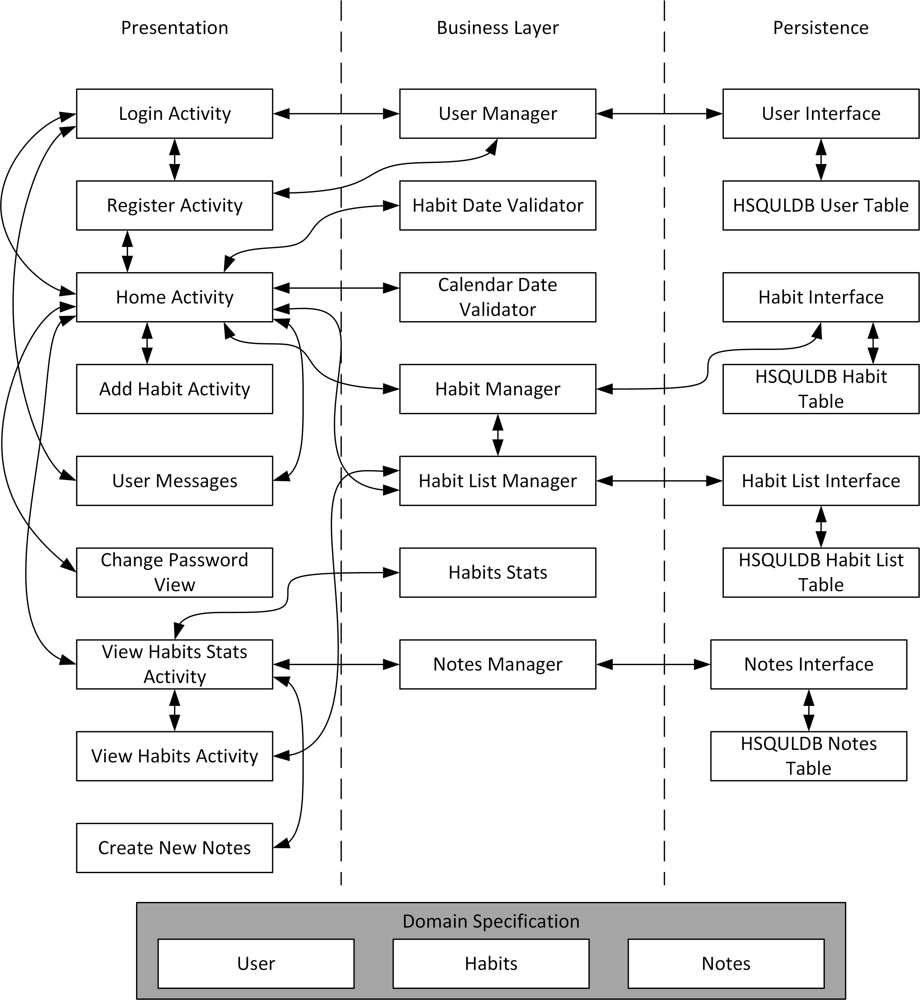

# Architecture:
The Habit Tracker application is designed with a 3-tier architecture. It is split up into 4 java packages: `DomainObjects`, `Presentation`, `Logic`, and `Persistence` (as displayed in the diagram).
# Presentation Layer
Our application has eight activities: `HomeActivity`, `AddHabitActivity`,`ViewHabitActivity`, `CreateNewNoteActivity`, `LoginActivity`, `RegisterActivity`,`ChangePasswordActivity`, and `ViewHabitStatsActivity`. The `LoginActivity` is the first screen seen when the app is opened and it lets the user login to their account. Alternatively, the `RegisterActivity` allows the user to create a new account. The `HomeActivity` is the home screen of the Habit Tracker, where the calendar is displayed along with a list of habits associated with the selected day. Habits will be displayed in order of the time of day specified. Users can click on the habit to check off the habit once, indicating that the habit has been completed for the day. Clicking the plus button switches to the `AddHabitActivity` screen. The `AddHabitActivity` allows the user to add new habits to the list of current habits. This includes setting the habit name, how many times a week the habit will occur and the time of day each habit is scheduled for. Users can also click the three dots at the top of the home screen to logout, change their password or view their habits. The `ChangePasswordActivity` allows the user to change their password. The `ViewHabitActivity` takes the user to a list of all their current habits. From here users can click a habit to change to the `ViewHabitStatsActivity` screen. The `ViewHabitStatsActivity` allows the user to view statisitcs related to a certain habit. These statistics include: average feeling, favourite day to complete the habit, the desired weekly completion, current completion amount, last completed date, and total times completed. The bottom half of this screen displays all the notes associated with the habit.  The `CreateNewNoteActivity` allows the user to create a note associated with a habit. This includes writing a note and assigning a feeling (bad, average, good) about the habit.   
# Business Layer
There are seven classes associated with the Business Layer of our application: `CalendarDateValidator`, `HabitDateValidator`, `HabitListManager`, `HabitManager`, `NoteManager`, `UserManager` and `HabitStats`. Both validator classes provide methods that verify that the input given by the presentation layer is correct and properly formatted. The `HabitListManager` manages the list of habits associated with each user. This includes updating the habit in the stub database, and keeping track of habit completion. The `HabitManager` allows habits to be added to the list, removed from the list and updated in the list. The `NoteManager` allows notes to be created for a specific habit, edited and removed from the database. The `UserManager` allows the user to login, register and change their password. The `HabitStats` class calculates statistics for a specified habit, as well as creates a message to be shared with Twitter. 
# Persistence Layer
The persistence layer has three interface: `HabitsPersistence`,`UsersPersistence`,`NotesPersistence`.The `UsersPersistence` interface allows us to add new users to the database.Both the `HabitsPersistence` and `NotesPersistence` interface gets the habits and notes associated with a given user, and provides methods for habits and notes to be added, removed or updated in the database.The `HabitsHSQLDB`,`UserHSQLBD`,`NotesHSQLBD` is directly used to query about information about the habits and notes associated with a given user.The `HabitStub`,`NotesStub`,`UserStub` classes are the stub databases implemented in this iteration. It provides an initial list of habits,notes and users for testing purposes as well as the implementation of all methods defined in the interface.
# Domain Objects
There are three domain objects in this application: `Habit`, `User` and `Note`. `Habit` represents a single, unique habit. The `User` object represents a unique user. The `Note` object represents a single, unique note.

