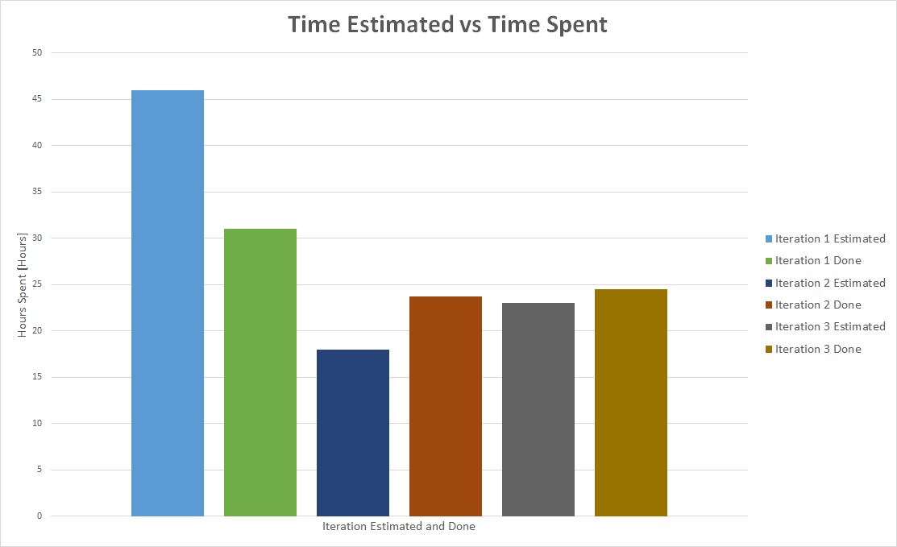

## Postmortem

​	In the iteration 2 retrospective, we identified communicating when someone completed a task or needed assistance with a task as an issue. This improved in iteration 3 as everyone made an effort to let the other members of the team know when changes were made or assistance was needed. If we had the chance to start over, we would re-estimate the amount of time required for each feature. We overestimated almost all of our features as we didn't know how android studio worked.

​	During the planning process, we had too many features scheduled to be completed in each iteration which lead to at least 1 feature needing to be moved in each iteration. This was mainly because we planned for each team member to complete a feature but didn't plan for someone to do the documentation, tests and Git management. We also re-evaluated the priorities of the features in iteration 2 as we had a better understanding about what was feasible to accomplish in android studio. 

​	During the early stages of planning, we had discussed doing a notification feature. However, this ended up being more difficult than expected as it needed to be moved from iteration 1 where it was scheduled, to the future. The information we found about how to implement notifications in android studio was for an older version, so it was difficult to translate to the version we were currently using. In iteration 2, we didn't have a place to integrate the notifications in. In iteration 3 there were unforeseen conflicts integrating the notification feature and subsequently testing it, so it was moved to the future.

​	Completing this project taught us that if 2 features need to be in the same form, it’s best if the same person does both of those features, otherwise there is too much time wasted waiting for each other to complete the feature. It also taught us that communication is key to a successful project. If we were to work on another project together, we would start doing more scrum meetings where we reported on the code completed that day and problems we were having. 
 